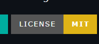

# 🍰 Chasha Bakers - Premium E-Commerce

<div align="center">
  
  <p align="center">
    <em>Defining the standard of premium baking. Taste the Magic, Live the Moment.</em>
  </p>

  
  
  
  <br><br>
  <a href="https://chasha-bakers.vercel.app"><strong>🌐 Live Site Demo</strong></a>
</div>

---

### 🚀 Stack

<div align="left">
  
  
  
  
  
  
</div>

---

### 🧩 Core Features

#### 📲 WhatsApp Ordering & Cart Integration
- **Guest Shopping Cart**: A fully responsive cart drawer with persistent localStorage state, featuring a sticky mobile floating cart button to streamline the checkout process on smaller screens.
- **Native WhatsApp Redirection**: Native protocol deep-linking (`whatsapp://send`) on mobile to bypass intermediate web-wrapper landing pages, sending structured order details directly to the bakery.
- **Variable Pricing Support**: Smooth support for custom cake selections where pricing is dynamically computed based on base values.

#### 🔥 Real-Time Cloud Integration (Firebase)
- **Firestore Database Integration**: Real-time snapshot subscriptions (`onSnapshot`) keep orders, reviews, and products perfectly in sync across all active client devices.
- **Cross-Tab Synchronization**: Uses LocalStorage storage event listeners (`storage` event) to ensure instant, multi-tab state alignment and 0ms latency page loads.
- **Firebase Storage Integration**: Handles client-side compressed image uploads for product additions, automatically optimizing loading speeds.

#### 🛡️ Secure Admin Portal & Dashboards
- **Live Order Tracker**: Tracks new, preparing, ready, delivered, and cancelled orders with status editing and order deletions.
- **Inventory Management**: Full product CRUD interface supporting dynamic category creation, optimistic UI updates, and real-time image updates.
- **Review Moderation**: Admins can approve, reject, or delete user-submitted reviews.
- **Enhanced UX**: Includes password visibility toggles on admin forms and robust 3-second database check timeout fallback bounds.

#### ⭐ Customer Reviews System
- **Zero-Latency Posting**: Client reviews are immediately rendered locally via optimistic UI and then updated with Firestore documents in the background.
- **Rich Display UI**: Features pagination ("Show More/Less" toggles) and custom masonry testimonial grids.

---

### 🛠️ Installation & Setup

#### Prerequisites
- Node.js (v20+)
- Firebase Project Setup (Firestore, Storage, and Auth)

#### Environment Configuration
Create a `.env.local` file in the root directory (using `.env.example` as a reference) and configure your Firebase keys:
```env
NEXT_PUBLIC_FIREBASE_API_KEY=your_api_key_here
NEXT_PUBLIC_FIREBASE_AUTH_DOMAIN=your_project_id.firebaseapp.com
NEXT_PUBLIC_FIREBASE_PROJECT_ID=your_project_id
NEXT_PUBLIC_FIREBASE_STORAGE_BUCKET=your_project_id.firebasestorage.app
NEXT_PUBLIC_FIREBASE_MESSAGING_SENDER_ID=your_messaging_sender_id
NEXT_PUBLIC_FIREBASE_APP_ID=your_app_id
```

#### Seeding the Database
The project includes automatic seeding. Upon the first initialization in the browser, if Firestore is detected as empty:
- Initial menu products will be automatically seeded.
- Initial approved reviews will be created.
- Default Admin credentials (`admin` / `admin`) will be initialized under the `admin_credentials` collection.

#### Project Setup
1. **Clone the repository**
   ```bash
   git clone https://github.com/rohan-ph/chasha-bakers.git
   cd chasha-bakers
   ```
2. **Install dependencies**
   ```bash
   npm install
   ```
3. **Run the development server**
   ```bash
   npm run dev
   ```

---

### 🌐 Deployment

Deployed and managed on **Vercel**.
- **Live URL**: [https://chasha-bakers.vercel.app](https://chasha-bakers.vercel.app)
- **Build Command**: `npm run build`
- **Publish Directory**: `.next`
- **Edge Functions**: Handled natively through Next.js serverless routes.

